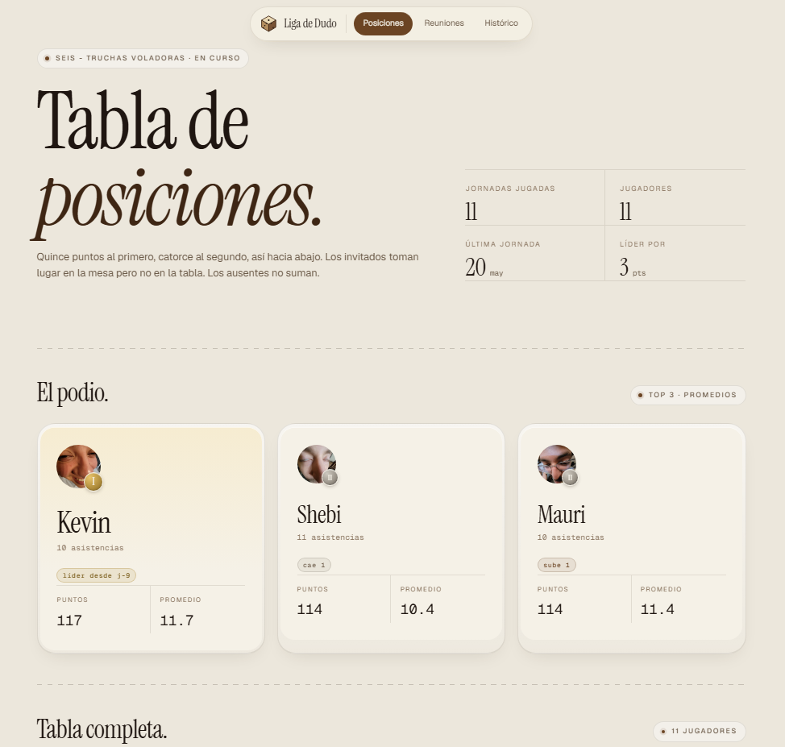

<div align="center">

# 🎲 duDapp

### A web platform to run a friendly **Dudo** (dice game) league — seasons, standings, stats and stories.

`English` · [Español](README.es.md)


</div>

---

> **What is Dudo?** A South American dice game (a cousin of *Liar's Dice* / *Perudo*). Friends gather weekly, play, and someone has to keep score. duDapp is that scorekeeper — turned into a real product.

<div align="center">
  
</div>

## The problem

A weekly Dudo league between friends used to live in scattered Google Drive sheets and Colab notebooks. Hard to update, hard to read, impossible to enjoy. The admin fought with spreadsheets; players had no clean way to check where they stood.

**duDapp** fixes that: the admin records each weekly meeting, and anyone — no account required — opens a public link to see live standings, per-round results and season stats.

## What makes it more than a CRUD

The interesting part isn't the screens — it's the **domain rules**. This app models a real game faithfully:

| Rule | Detail |
|------|--------|
| 🏆 **Positional scoring** | 1st place always gets 15 pts, 2nd gets 14… position *N* = `15 − (N−1)`, regardless of how many show up |
| 👤 **Guests** | Occupy a position and consume points, but **never** appear in the season table |
| 🚫 **Absentees** | Score 0; a player's average is computed only over real attendances |
| 🔒 **Immutable seasons** | Once a season is closed, it can't be edited — ever |
| ⚖️ **Tie-breaking** | Ties at season close are resolved by head-to-head, with an admin flow to crown the champion |
| ➕ **Mid-season joins** | Late players count as absent (0 pts) in prior rounds; their average reflects only real attendances |

All of this lives in **pure, testable business logic** — not buried in HTTP handlers.

## Tech stack & architecture

| Layer | Tech |
|-------|------|
| **Backend** | FastAPI (Python), SQLAlchemy, Alembic migrations |
| **Frontend** | React SPA, Vite, React Router |
| **Database** | PostgreSQL on Neon (serverless) |
| **Auth** | Custom JWT (PyJWT), single admin |
| **Testing** | pytest (backend) + Vitest / React Testing Library (frontend) |

The backend follows a clean layered design — the kind that keeps logic honest:

```
HTTP request
   │
   ▼
routers/      ← receive requests, return responses (thin)
   │
   ▼
services/     ← pure business logic (no API, no DB — fully unit-testable)
   │
   ▼
models/ + schemas/   ← SQLAlchemy tables (PostgreSQL/Neon) + Pydantic validation
```

**Methodology:** pragmatic **TDD** (tests before implementation, focused on business rules — not trivial getters/setters) and **SDD** (every feature is born from a spec in `/docs`).

## The road so far

This project grew in deliberate phases — each one a building block, not a sprint to a demo:

| Phase | What was built |
|-------|----------------|
| **1 · Foundations** | FastAPI project, SQLAlchemy models, Alembic migrations, JWT auth, DB connected, CORS solved |
| **2 · Business logic** | Scoring engine, create/edit season, record/edit meeting, close season — all via TDD |
| **3 · Public data** | Read endpoints for spectators: standings (with visibility rules), per-round results, season stats |
| **4 · Frontend base** | React SPA with public views: standings with medals, results with guest badges, stats |
| **5 · Admin frontend** | Protected views: JWT login, dashboard, create season, record/edit meeting with drag & drop, share link |
| **6 · Polish & launch** | Production deploy (Render + Vercel + Neon), full editorial *cream/leather* redesign across 9 pages |
| **7 · Post-launch** | Narrative ranking, champion seal, cross-season history, CSV import, OWASP security hardening |

## Highlight features

- **📈 Narrative ranking** — position snapshots per round power pills like *"up N"*, *"down N"*, *"streak of N"*, *"leader since round N"*.
- **👑 Champion seal** — when there's no active season, the last closed one shows its final ranking inside an ornamented golden seal (laurels, serif italics, Roman-numeral year).
- **🗂️ Cross-season history** — public aggregated stats spanning every season.
- **📥 CSV import** — an admin endpoint that backfilled 5 historical seasons predating the system.

## Lessons learned (the real ones)

Operating in production teaches things localhost never will. Two that stuck:

- **🔐 JWTs were being signed with a public fallback secret in production.** `JWT_SECRET` had never been set on Render, so the app silently fell back to a default. Caught during an OWASP Top 10 audit → rotated the secret and added a **fail-fast** check so the app refuses to boot without a real secret. (Shipped as part of the security-hardening phase, alongside login rate-limiting, upload validation, and disabling `/docs` in prod.)
- **🚀 Render does not run migrations for you.** Deploys were shipping code ahead of the schema until the start command was updated to run `alembic upgrade head` on every deploy.

These aren't footnotes — they're the difference between "it works on my machine" and "it runs in production."

## Deployment

```
   Browser
      │
      ▼
  React SPA  ──►  FastAPI API  ──►  PostgreSQL
  (Vercel)        (Render)          (Neon)
```

- **Frontend → Vercel** (with rewrites for client-side routing)
- **Backend → Render** (runs `alembic upgrade head` on each deploy)
- **Database → Neon** (serverless PostgreSQL)

In production since **Apr 2026**.

## Running locally

```bash
# Backend
cd backend
python -m venv venv && source venv/bin/activate   # Windows: venv\Scripts\activate
pip install -r requirements.txt
alembic upgrade head
uvicorn app.main:app --reload

# Frontend
cd frontend
npm install
npm run dev
```

**Required environment variables** (never committed — use a local `.env`):

| Variable | Purpose |
|----------|---------|
| `DATABASE_URL` | PostgreSQL connection string |
| `JWT_SECRET` | Secret used to sign tokens (the app **won't boot** without it) |
| `CORS_ORIGINS` | Allowed frontend origins |

Run the test suites with:

```bash
cd backend && pytest          # backend
cd frontend && npm test       # frontend
```

---

<div align="center">

Built as a learning journey — from a spreadsheet to a production product. 🎲

</div>
